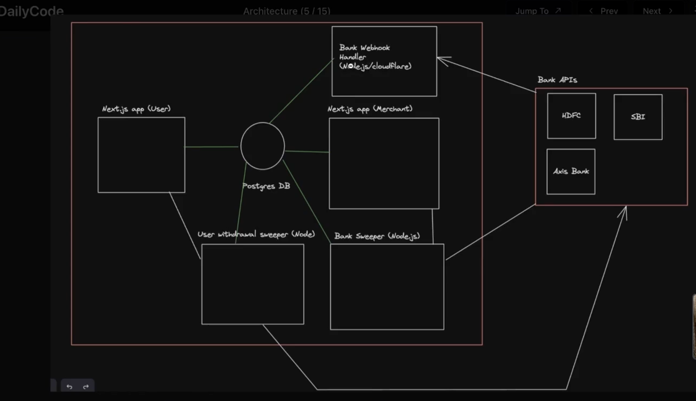
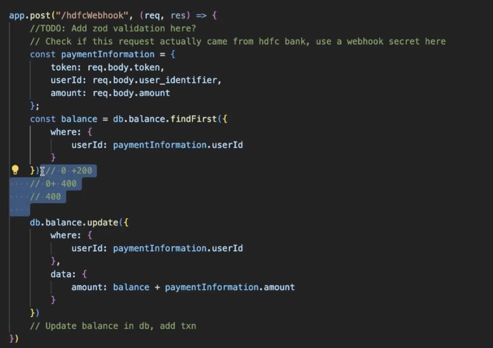
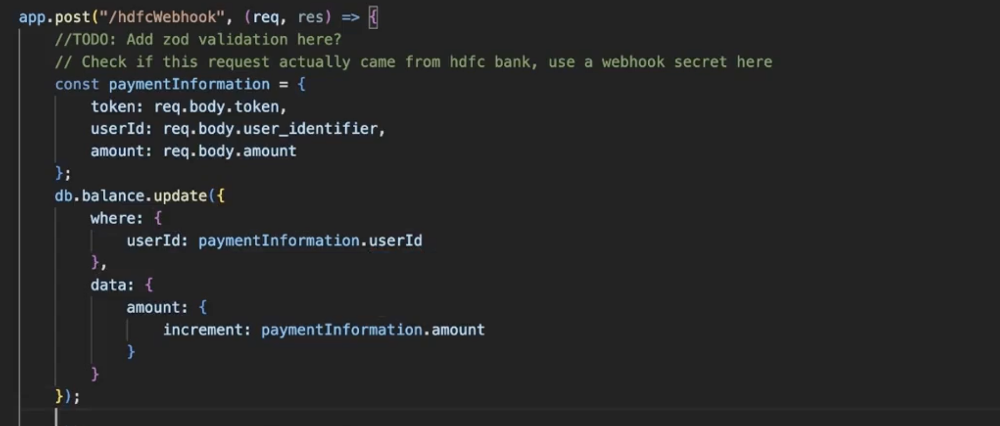

## On Ramping

- This for small business we do using third party apps, talking to bank and taking care of transactions.
- addition vs increment approach, addition bad one as when two simultaneous request will come it will cause problem
  
  

## Steps

1. Cloning the repo

2. npm install

3. cd packages/db

4. np prisma migrate dev

5. npx prisma generate

6. Add -env file to app/user-app

7. npm run dev
